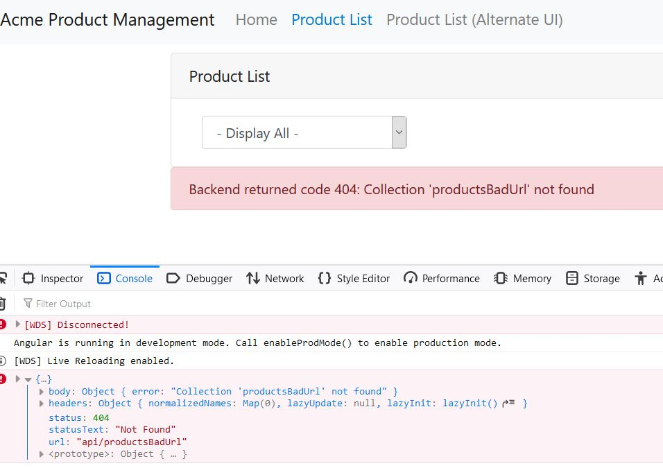

# Project: APM-RXJS-START

This project was generated with [Angular CLI](https://github.com/angular/angular-cli) version 10.0.1.

## Kanban Task #1: Flash Card and Code Examples in "https://stackblitz.com/"

### Task: Handling Errors

1. Module #5 Going Reactive - Handling Errors Demo
2. "Catch and Replace" code

### Example uses: Replace original Observable stream with

1. An Observable created from hard-coded or local data.
2. An Observable that emits emty value OR empty array
3. Return RxJS constant EMPTY

### Catch and Replace Error Handling

```TypeScript
/**
 * Product Service
 */
return this.http.get<Product[]>(this.productsUrl)
   .pipe(
      catchError(err => {
        // stream is stopped, err emited
        console.error(err); 
        // new stream emited default array of products
        return of ([
          {id:1 productName: 'cart'},
          {id:2, poductName: 'hammer'}
        ]);
      });
   )
```

```TypeScript
/**
 * Product List Component
 */
ngOnInit() {
  this.productService.getProducts()
    .subscribe(
      // the observers next method is fired with the new default array
      products => this.products = products,
      // the err is not raised because the err has been caught and replaced
      err => this.errorMessage = err
    );
}
```

### Catch and Rethrow Error Handling

```TypeScript
/**
* Product Service
*/
private productUrl = 'api/products';

return this.http.get<Product[]>(this.productsUrl)
 .pipe(
   catchError(err => {
     // stream is stopped, err emited
     console.error(err);
     // throw an error NOTE throwError is actually a creation function
     // it emits no items (Observable<never>) but immediatly emits an error notification
     return  throwError(err);
   });
 )
```
 
### Common Pattern with Error Handling

```TypeScript
/**
* Product Service
*/
private productUrl = ' api/products';

getProducts(): Observable<Product[]> {
  return this.http.get<Product[]>(this.productUrl)
   .pipe(
     catchError(this.handleError)
   );
}

private handleErrora(err) {
  //...
  return throwError(errorMessage);
}
```

### Classic code (List Component)

```TypeScript
this.productService.getProducts()
 .subscribe(
   products => this.products = Products, // next
   err => this.errorMessage = err,       // err
   // completed
 )
```

### Updated Code (List Component)

```TypeScript
this.products$ =  this.productService.getProducts()
 .pipe(
   catchError(err => {
     this.errorMeessage = err;
     return ???;
   })
 );
```

### Task: Handling Errors: Demo

```TypeScript

/**
 * prouct.service.ts
 */

getProducts(): Observable<Product[]> {
    return this.http.get<Product[]>(this.productsUrl)
      .pipe(
        tap(data => console.log('Products: ', JSON.stringify(data))),
        catchError(this.handleError)
      );
  }

  //...

  private handleError(err: any): Observable<never> {
    // in a real world app, we may send the server to some remote logging infrastructure
    // instead of just logging it to the console
    let errorMessage: string;
    if (err.error instanceof ErrorEvent) {
      // A client-side or network error occurred. Handle it accordingly.
      errorMessage = `An error occurred: ${err.error.message}`;
    } else {
      // The backend returned an unsuccessful response code.
      // The response body may contain clues as to what went wrong,
      errorMessage = `Backend returned code ${err.status}: ${err.body.error}`;
    }
    console.error(err);
    return throwError(errorMessage);
  }
```

```TypeScript
/**
 * product-list.component.ts
 */

  // unsubscrible built-in
  ngOnInit(): void {
    this.products$ = this.productService.getProducts()
    .pipe(
      catchError ((err) => {
        this.errorMessage = err;
        //return of ([]);
        return EMPTY;
      })
    );
  }
```


